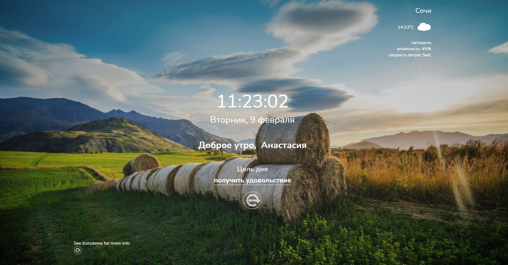

# RSschool_momentum
This is task from RSschool (https://rs.school/js/)
## RSS Моментум
#### my realisation (https://vigilant-mcclintock-2c4c79.netlify.app/)

Momentum - аналог одноимённого приложения интернет-магазина Chrome. Приложение показывает время и имя пользователя, его цель на текущий день. Фоновое изображение меняется в зависимости от времени суток. Для хранения данных приложение использует локальное хранилище - local storage. Автор - Brad Traversy.

##### Базовая функциональность

    - Время выводится в 24-часовом формате, обновляется каждую секунду
    - Выводится день недели, дата, месяц, например: "Пятница, 25 ноября"
    - Можно ввести имя пользователя и его цель. Для ввода данных используется клавиша Enter
    - Имя пользователя и его цель сохраняются в local storage и отображаются после обновления страницы
    - Фоновое изображение и приветствие изменяются в зависимости от времени суток (утро, день, вечер, ночь)
    - При клике в поле ввода текст, который там был, исчезает, если пользователь ничего не ввёл или ввёл
    пустую строку, текст восстанавливается

##### Смена фонового изображения

    - Фоновые изображения меняются каждый час и выбираются в зависимости от времени суток (утро, день, 
    вечер, ночь)
    - Есть кнопка, при клике по которой можно пролистать все фоновые изображения за сутки
    - Изображения пролистываются в том же порядке, в котором они менялись бы в реальном времени (утро, день, 
    вечер, 
    ночь), начиная с того, которое соотвествует текущему времени суток
    - При обновлении страницы формируется новый список фоновых изображений на текущие сутки
    - При клике по кнопке для обновления фонового изображения происходит плавная смена фоновых изображений, 
    нет ситуации, когда пользователь видит частично загрузившееся изображение
    
##### Цитата дня:

    - При загрузке приложения выводится цитата или другой короткий текст (высказывание, шутка, анекдот и т.д.)
    - При перезагрузке страницы цитата заменяется на другую
    - Есть кнопка, при клике по которой меняется цитата

##### Прогноз погоды:

    - В приложении есть возможность указать город
    - Для указанного пользователем города выводится прогноз погоды
    - Указанный пользователем город сохраняется в local storage и отображается при обновлении страницы. Также
    отображается прогноз погоды для него
    - Прогноз погоды включает в себя данные о температуре, относительной влажности воздуха, скорости ветра
    - Прогноз погоды включает в себя иконку погоды
    - Если пользователь вводит пустую строку, данные не меняются, отображается прежний прогноз погоды. Если пользователь
    вводит данные, для которых API погоды не возвращает результат, выводится уведомление об ошибке в человекочитаемом
    формате

##### Адаптивный дизайн:

    - Элемены приложения оптимально занимают площадь страницы
    - Приложение корректно отображается как на компьютере, так и на мобильных устройствах. Отсутствует горизонтальная 
    полоса прокрутки. Минимальное разрешение экрана, при котором проверяем корректность отображения приложения - 320px
    - При смене даты и времени, смене цитаты, смене фонового изображения, содержание страницы не дёргается, размеры
    блоков остаются прежними, кнопки для смены цитаты и смены фонового изображения остаются на своих местах
    - Шрифт достаточного размера (не меньше 14рх) и контрастности Colour contrast checking tool, хорошо читается на
    любом фоне.
    Можно использовать полупрозрачный overlay (есть в коллекции изображений) или другой способ, позволяющий обеспечить 
    читаемость текста.
    - Интерактивность кликабельных элементов не сводится к свойству cursor:pointer. Стили при наведении, фокусе, клике
    меняютсz плавно (используйте свойство transition или @keyframes)
    
#### Полезные ссылки:
    - [Demo](https://irinainina.github.io/ready-projects/momentum/)
    - [Tutorial](https://youtu.be/fSTQzlprGLI)
    - [Дата и время](https://learn.javascript.ru/date)
    - [Window.localStorage](https://developer.mozilla.org/ru/docs/Web/API/Window/localStorage)
    - [JavaScript. Как работает Async, Await](https://youtu.be/SHiUyM_fFME)

#### API с цитатами:
    - https://favqs.com/api/qotd
    - https://type.fit/api/quotes
    - https://api.adviceslip.com/advice
    - https://api.chucknorris.io/jokes/random
    - https://programming-quotes-api.herokuapp.com/quotes
    - https://quote-garden.herokuapp.com/api/v2/quotes/random
    - https://quotesondesign.com/wp-json/wp/v2/posts/?orderby=rand

